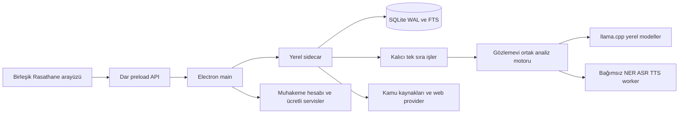

# Rasathane mimarisi

Sahip: **Av. Mehmet Arın Gülüm**.

Rasathane yerel öncelikli bir kaynak takip ve araştırma uygulamasıdır. Electron sandbox renderer yalnız dar preload metotlarına erişir. Main, uygulamanın kendi loopback sidecar'ını başlatır ve istemleri izin verilen API yollarına iletir. Renderer dosya sistemi, shell, token veya ham IPC erişimi almaz.

## Veri ve iş yaşam döngüsü

Kullanıcı verisi source checkout'tan ayrıdır. SQLite metadata, kaynak sürümleri, hash, notlar, çalışma alanları ve iş durumlarını saklar. Büyük artifacts kullanıcı çalışma alanında kalır. Eski Radar verisi salt okunur import edilir; eski analiz sözleşmesinin bütün alanları korunur.

İşler kalıcı kimlikle queued/running/completed/failed/cancelled/interrupted olarak takip edilir. Running iptali cooperative'dir: sürmekte olan provider çağrısını kesmiş gibi gösterilmez. Yeniden açılış yarıda kalmış işi başarılı saymaz. Eşzamanlı ağır inference yerine tek sıra ve spawn öncesi anlık RAM denetimi kullanılır. Düşük bellek profilinde LLM ve embedding birlikte tutulmaz.

Kaynak edinimi SSRF denetimi, içerik sınırı, timeout, provenance ve içerik SHA256'sı ile çalışır. Araştırma tam metin, snippet ve erişilemeyen kaynak durumlarını ayırır. Kaynak bulunmadığında uydurma kaynak veya cevap üretilmez. Konu takibi yenileme farkını ve son başarılı zamanı saklar; başarısız yenilemede stale kayıt görünür olur.

## Açık çekirdek ve ticari sınır

Yerel kaynak edinimi, çalışma alanı, araştırma, analiz, storage ve desktop kabuğu AGPL-3.0-or-later kapsamındadır. Muhakeme İçtihat'ın tescilli implementation'ı bu depoya taşınmaz. Ücretli servis API sözleşmesi açık belgelenir; sunucu implementation'ı, sağlayıcı credential'ları, ticari kararlar ve marka hakları ayrı kalır. Yerel çekirdek üyelik kontrolüyle kilitlenmez.

Bu belge uygulama ile birlikte güncellenir. Tasarım veya test harness'inin geçmesi yayın, gerçek 8 GB uyumluluğu veya uzak teslim kanıtı sayılmaz.
